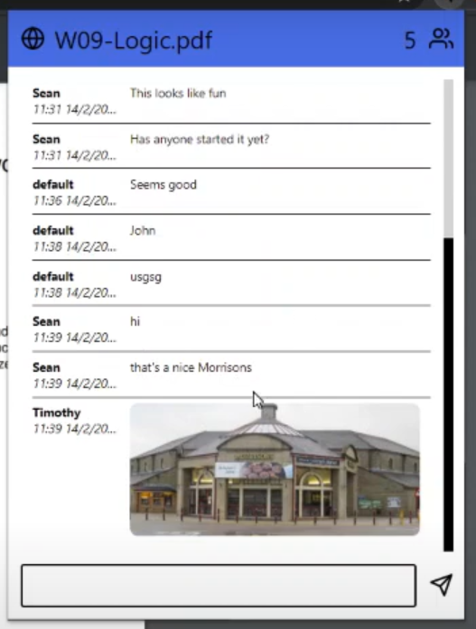
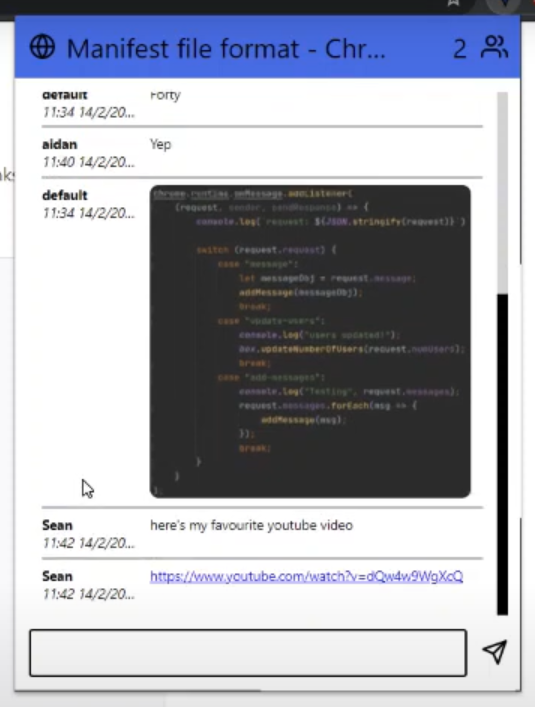

# Chrome Chats

## What is it?

This project was created over a gruelling 24 hours of non-stop programming for [Stacshack 2021](https://stacshack-007.devpost.com/)! It was, of course, completed virtually due to the pandemic.

## What does it do?

It creates a popup chat room for every link you visit. You can chat live to other people viewing that page. The chat also has support for copy and pasted images as well as autmatic URL hyperlinking. 

Chats are saved so you can ask questions and come back later, or peruse historical messages with a (kinda of working) pagination system.

 | 
--- | --- 
Example 1 | Example 2

## Submission Video

<iframe width="560" height="315"
src="https://www.youtube.com/watch?v=01KvCFBE4KIU" 
frameborder="0" 
allow="accelerometer; autoplay; encrypted-media; gyroscope; picture-in-picture" 
allowfullscreen>
</iframe>
